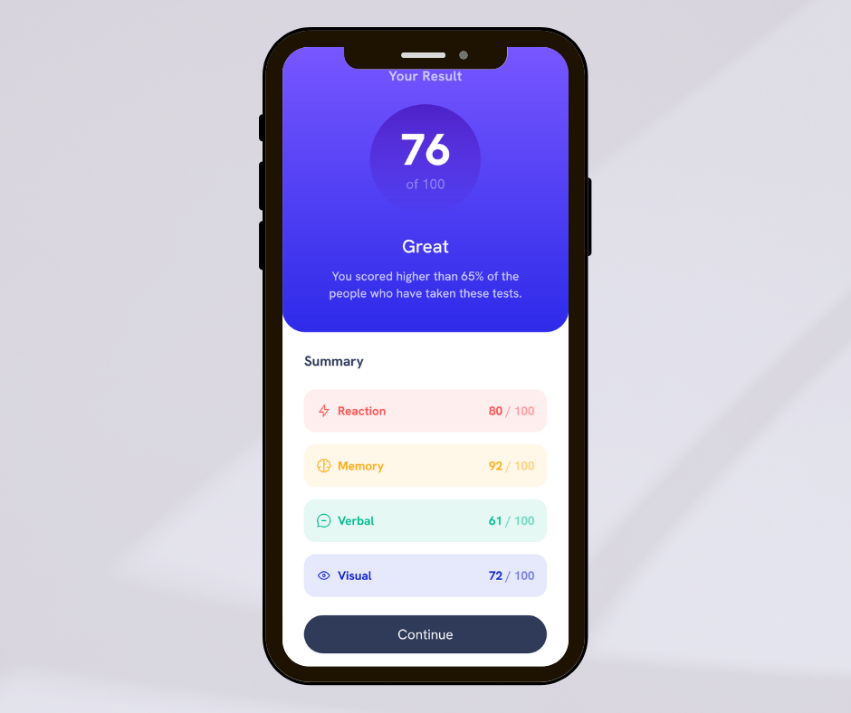

# Frontend Mentor - Results summary component solution

This is a solution to the [Results summary component challenge on Frontend Mentor](https://www.frontendmentor.io/challenges/results-summary-component-CE_K6s0maV). Frontend Mentor challenges help you improve your coding skills by building realistic projects. 


## Table of contents

- [Overview](#overview)
  - [The challenge](#the-challenge)
  - [Screenshot](#screenshot)
  - [Links](#links)
- [My process](#my-process)
  - [Built with](#built-with)
  - [What I learned](#what-i-learned)
  - [Continued development](#continued-development)
  - [Useful resources](#useful-resources)
- [Author](#author)
- [Acknowledgments](#acknowledgments)
<br />
<br />

## Overview

### The challenge

Users should be able to:
- View the optimal layout fo r the interface depending on their device's screen size
- See hover and focus states for all interactive elements on the page
- **Bonus**: Use the local JSON data to dynamically populate the content

### Screenshot

<div align="center">
<h3>Mobile</h1>
	
<h3>Desktop</h1>

</div>


### Links
  |||
  | :----- | :----- |
  | Solution URL: | [Add solution URL here](https://your-solution-url.com)|
  | Live Site URL: | [Add live site URL here](https://your-live-site-url.com) |
  |||

- Solution URL: [Add solution URL here](https://your-solution-url.com)
- Live Site URL: [Add live site URL here](https://your-live-site-url.com)
<br />
<br />

## My process

### Built with

- Semantic HTML5 markup
- CSS Custom properties
- [Fluid Typography with CSS clamp()](https://chriskirknielsen.com/blog/modern-fluid-typography-with-clamp/)
- CSS Grid
- Flexbox
- [SASS](https://sass-lang.com/) - Maps for Breakpoint mixin
- [BEM Notation](https://getbem.com/)
- [Fetch Json](https://developer.mozilla.org/en-US/docs/Web/API/Fetch_API/Using_Fetch)
- Mobile-first workflow
- [Vite](https://vitejs.dev/) 

### What I learned

- To avoid repetitions you can write dynamic mixins based on their media query context. A map of breakpoints, associated to names and widths can be implemented:

```scss
@mixin breakpoint($size){
    @media (min-width: map-get($breakpoints-up, $size)) {
        @content;
    }
}
```

- To visually hide an element but keep them accessible to assistive technologies (screen readers):

```scss
    .visually-hidden {
    position: absolute;
    left: -10000px;
    top: auto;
    width: u.rem(1);
    height: u.rem(1);
    overflow: hidden;
}
```

- Fetch JSON data:

```Javascript
fetch("data.json")
  .then((response) => response.json())
  .then((data) => {
    data.map((element) =>
        {
          ...  
        });
  })
  .catch(console.error);
```

- Fluid typography with clamp()

```scss
h3 {
    font-size: clamp(u.rem(24), 1.2413793103448276rem + 1.103448275862069vw, u.rem(32));
}
```
### Continued development

- Accessible to screen reader users,
- Dynamically populate the content from JSON file for the score and find another solution with arrays.

### Useful resources

- [A Modern CSS Reset](https://www.joshwcomeau.com/css/custom-css-reset/) - A detailed explanation of CSS Reset by Josh W. Comeau
- [Maps for Breakpoint mixin](https://jdsteinbach.com/css/sass-maps-breakpoint-mixin/)
- [Fluid Typography with CSS clamp()](https://royalfig.github.io/fluid-typography-calculator/) - Help calculate a Fluid Typography Scale
<br />
<br />

## Author

- Frontend Mentor - [@ChristinePena](https://www.frontendmentor.io/profile/ChristinePena)
<br />
<br />

## Acknowledgments

- [Coder Coder](https://www.youtube.com/@TheCoderCoder)
- [Kevin Powell](https://www.youtube.com/@KevinPowell)
